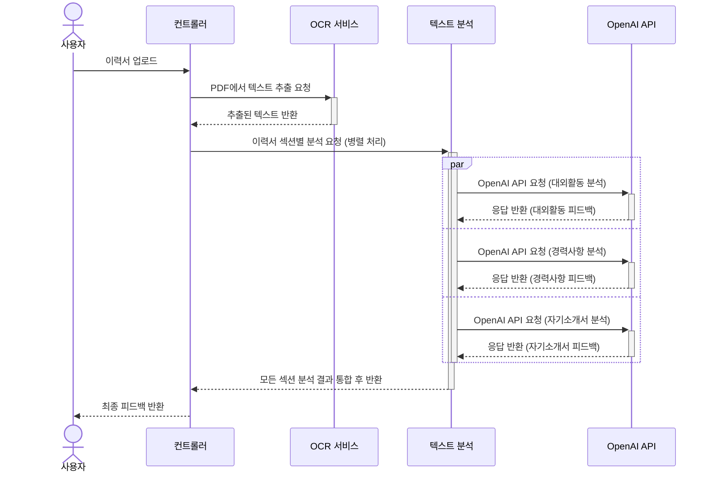

```mermaid
sequenceDiagram
        actor 사용자 as 사용자
        participant 컨트롤러 as 컨트롤러
        participant OCR as OCR 서비스
        participant 텍스트분석서비스 as 텍스트 분석
        participant OpenAI as OpenAI API

        사용자 ->> 컨트롤러: 이력서 업로드
        컨트롤러 ->>+ OCR: PDF에서 텍스트 추출 요청
        OCR -->>- 컨트롤러: 추출된 텍스트 반환

        컨트롤러 ->>+ 텍스트분석서비스: 이력서 섹션별 분석 요청 (병렬 처리)
        activate 텍스트분석서비스
        par
        텍스트분석서비스 ->>+ OpenAI: OpenAI API 요청 (대외활동 분석)
        OpenAI -->>- 텍스트분석서비스: 응답 반환 (대외활동 피드백)
        and
        텍스트분석서비스 ->>+ OpenAI: OpenAI API 요청 (경력사항 분석)
        OpenAI -->>- 텍스트분석서비스: 응답 반환 (경력사항 피드백)
        and
        텍스트분석서비스 ->>+ OpenAI: OpenAI API 요청 (자기소개서 분석)
        OpenAI -->>- 텍스트분석서비스: 응답 반환 (자기소개서 피드백)
        end
        deactivate 텍스트분석서비스
        텍스트분석서비스 -->>- 컨트롤러: 모든 섹션 분석 결과 통합 후 반환

        컨트롤러 -->> 사용자: 최종 피드백 반환

```